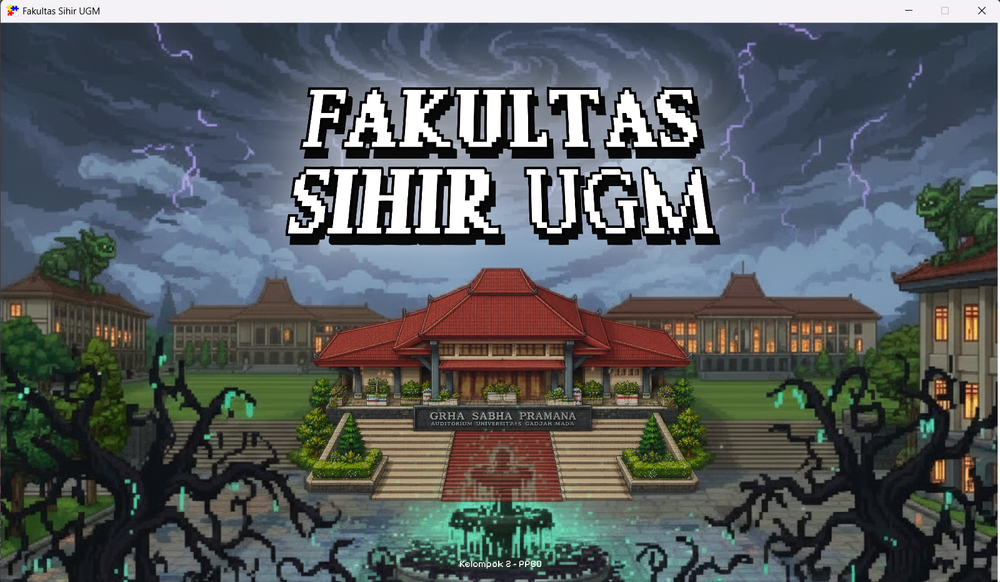
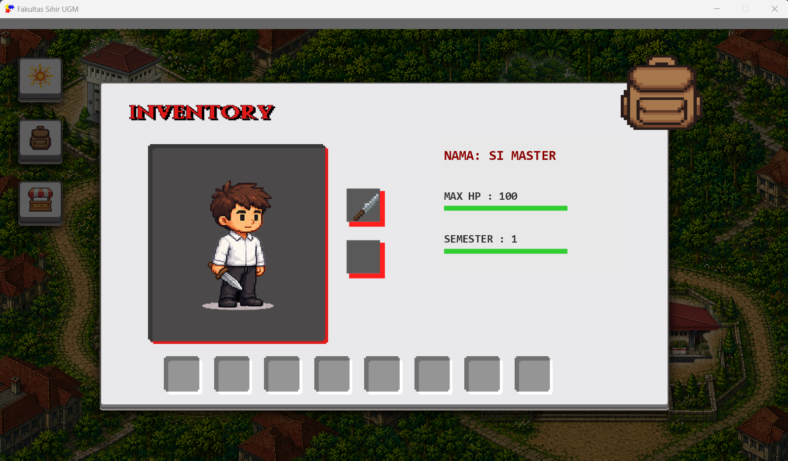
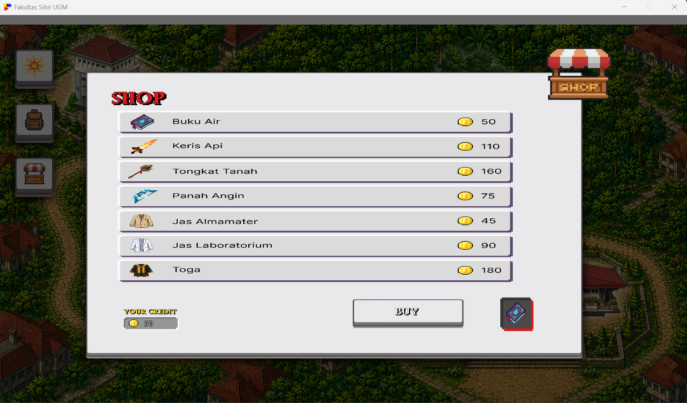
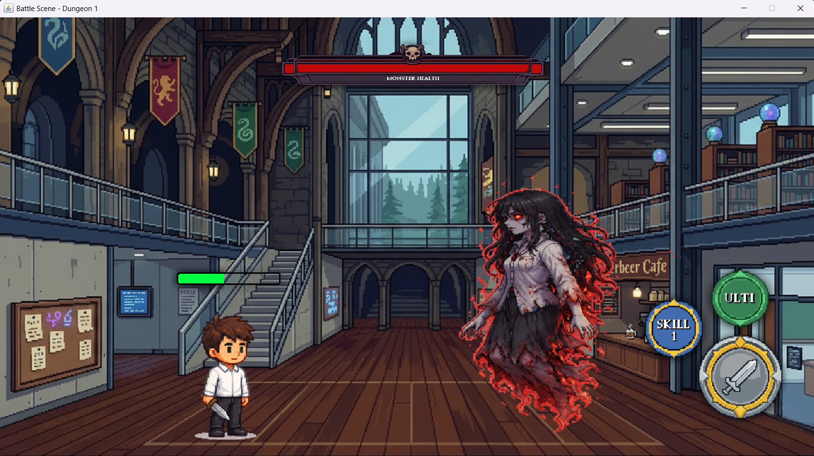

# Game Fakultas Sihir UGM
> **Proyek Akhir UAS Mata Kuliah Pemrograman Berorientasi Objek (PPBO) - Universitas Gadjah Mada**

Game RPG Akademik bertema kampus Universitas Gadjah Mada yang menggabungkan konsep perkuliahan Bulaksumur dengan dunia sihir fantasi. Dibuat menggunakan prinsip Object-Oriented Programming (OOP) yang terstruktur, modular, dan terdokumentasi dengan baik untuk keperluan submission akademik, laporan, dan presentasi UAS.

---

## 🎮 Fitur Utama (Main Features)

1.  **Exploration Mode (Eksplorasi Peta)**: Menjelajahi wilayah kampus UGM (MIPA, Bulaksumur, Biologi, Gedung Pusat) secara grafis.
2.  **RPG Turn-Based Combat (Swing GUI)**: Pertarungan sihir akademik melawan kroco dan Boss dengan status bar HP, cooldown skill (Basic, Normal, Ultimate), serta visualisasi sprite karakter sesuai dengan perlengkapan senjata dan armor aktif.
3.  **Inventory & Equipment System**: Mengelola perlengkapan senjata (Buku Air, Keris Api, Panah Angin, Tongkat Tanah, Pisau Neutral) dan pelindung (Almamater, Jas Lab, Toga) secara real-time.
4.  **KOPMA UGM Shop**: Melakukan pembelian senjata dan armor menggunakan akumulasi Battle Point (BP) hasil memenangkan pertarungan.
5.  **Multi-Mode Interface**: Mendukung peluncuran grafis (GUI) berbasis **FXGL** dan mode CLI teks interaktif.

---

## 📸 Screenshot Game

### Main Menu

Tampilan awal game Fakultas Sihir UGM.

### Inventory System

Sistem inventory untuk melihat karakter, senjata, armor, dan item yang dimiliki pemain.

### Shop System

Toko untuk membeli weapon dan armor menggunakan Battle Point (BP).

### Battle System

Sistem pertarungan melawan monster menggunakan weapon dan skill yang dimiliki karakter.

---

## 🛠️ Teknologi & Framework (Technology Stack)

*   **Runtime Environment**: Java SDK 21 / 25
*   **Game Framework**: FXGL (JavaFX Game Library) 21.1
*   **User Interface**: JavaFX (peta eksplorasi) & Java Swing AWT (layar pertarungan GUI)
*   **Build Tool**: Apache Maven 3.x
*   **Version Control**: Git & GitHub

---

## 📂 Struktur Paket & Proyek (Project Structure Overview)

Kode sumber diatur secara modular ke dalam sub-paket `org.example.*` di folder `src/main/java/`:

*   `org.example.core`: Launcher utama (`FakultasSihirApp` untuk GUI, `Main` untuk CLI).
*   `org.example.character`: Domain model Karakter dan kalkulasi stat player.
*   `org.example.battle`: Engine pertarungan, manajemen giliran, dan data Dungeon.
*   `org.example.inventory`: Pengelolaan tas dan daftar item penyimpanan.
*   `org.example.shop`: Logika toko Kopma UGM.
*   `org.example.items`: Class induk `Item`, `Weapon`, `Armor` serta turunan senjata elemen.
*   `org.example.monsters`: Logika monster, random AI skill, dan modifier elemen.
*   `org.example.ui`: JFrame Swing renderer untuk antarmuka pertarungan GUI (`BattleScene`).
*   `org.example.utils`: Konfigurasi Enum untuk sistem elemen sihir (`Elemen`).

---

## 🚀 Cara Menjalankan Proyek (Instructions for Running)

### Prasyarat (Prerequisites)
1.  Pastikan **Java JDK 21** atau versi lebih baru telah terinstal.
2.  Gunakan IDE **IntelliJ IDEA** (sangat direkomendasikan).

### Menjalankan Mode Grafis (GUI / FXGL Launcher)
1.  Buka proyek di IntelliJ IDEA sebagai proyek Maven.
2.  Tunggu hingga Maven menyelesaikan sinkronisasi dependency (`pom.xml`).
3.  Navigasikan ke `src/main/java/org/example/core/FakultasSihirApp.java`.
4.  Klik kanan dan pilih **Run 'FakultasSihirApp.main()'**.

### Menjalankan Mode Teks (CLI Launcher)
1.  Navigasikan ke `src/main/java/org/example/core/Main.java`.
2.  Klik kanan dan pilih **Run 'Main.main()'**.

---

## 📚 Dokumentasi Proyek

Untuk membantu penyusunan laporan dan presentasi UAS PPBO, kami menyediakan dokumentasi pendukung berikut:

- [UML Diagram](UML_CLASS_DIAGRAM.md)
- [Implementasi OOP](OOP_IMPLEMENTATION.md)
- [Struktur Kode Program](PROJECT_STRUCTURE.md)
- [Panduan Penyusunan Laporan](REPORT_GUIDE.md)
- [Pembagian Tugas Kelompok](TEAM_CONTRIBUTION_TEMPLATE.md)
- [Audit Proyek](FINAL_PROJECT_AUDIT.md)
- [Riwayat Perubahan](CHANGELOG_PROJECT.txt)

---

## 👥 Anggota Kelompok

| Nama Lengkap | Peran Pengembangan |
|-------------|-------------------|
| Haydar Istma Ulhaq | Logika Game |
| Achwan Anwar Hakim | Desain Assets |
| Ahmad Tariq Hifzhillah | Desain Assets |
| Hammam Muhammad Shidqii | GUI |
| Muhammad Ardra Wirya | GUI |

---

## 📋 Pembagian Tugas Presentasi

| Materi Presentasi | Penanggung Jawab |
|------------------|------------------|
| Pendahuluan | Achwan Anwar Hakim |
| Desain Sistem (UML, Diagram, dsb.) | Haydar Istma Ulhaq |
| Implementasi OOP | Ahmad Tariq Hifzhillah |
| Struktur Kode Program | Haydar Istma Ulhaq |
| Demo Program | Hammam Muhammad Shidqii |
| Analisis | Muhammad Ardra Wirya |
| Pembagian Tugas Kelompok | Achwan Anwar Hakim |

---

## 📌 Status Proyek

Status saat ini: Siap untuk Pengumpulan UAS PPBO.

Repository masih dapat menerima perbaikan minor, penyempurnaan dokumentasi, dan penyesuaian berdasarkan hasil evaluasi kelompok sebelum batas waktu pengumpulan akhir.