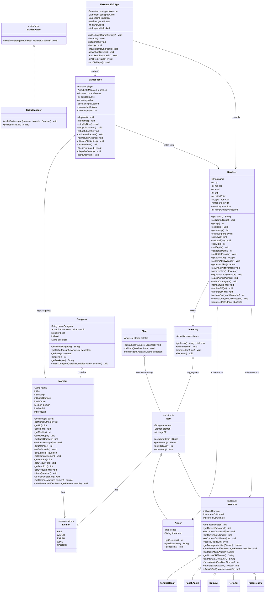

# UML Class Diagram

This document contains the UML Class Diagram for **Game Fakultas Sihir UGM** generated using Mermaid syntax.

```mermaid
classDiagram
    direction TB

    %% Packages definition
    class Elemen {
        <<enumeration>>
        FIRE
        WATER
        EARTH
        WIND
        NEUTRAL
    }

    class Item {
        <<abstract>>
        -String namaItem
        -Elemen elemen
        -int hargaBP
        +getNamaItem() String
        +getElemen() Elemen
        +getHargaBP() int
        +cloneItem()* Item
    }

    class Weapon {
        <<abstract>>
        -int baseDamage
        -int currentCdNormal
        -int currentCdUltimate
        +getBaseDamage() int
        +getCurrentCdNormal() int
        +setCurrentCdNormal(int) void
        +getCurrentCdUltimate() int
        +setCurrentCdUltimate(int) void
        +reduceCooldown() void
        +getDamageModifier(Elemen) double
        +printElementalEffectMessage(Elemen, double) void
        +getBasicAttackName()* String
        +getNormalSkillName()* String
        +getUltimateSkillName()* String
        +basicAttack(Karakter, Monster)* int
        +normalSkill(Karakter, Monster)* int
        +ultimateSkill(Karakter, Monster)* int
    }

    class Armor {
        -int defense
        -String tipeArmor
        +getDefense() int
        +getTipeArmor() String
        +cloneItem() Item
    }

    class Karakter {
        -String nama
        -int hp
        -int maxHp
        -int level
        -int exp
        -int battlePoint
        -Weapon itemAktif
        -Armor armorAktif
        -Inventory inventory
        -int maxDungeonUnlocked
        +getNama() String
        +setNama(String) void
        +getHp() int
        +setHp(int) void
        +getMaxHp() int
        +setMaxHp(int) void
        +getLevel() int
        +setLevel(int) void
        +getExp() int
        +setExp(int) void
        +getBattlePoint() int
        +setBattlePoint(int) void
        +getItemAktif() Weapon
        +setItemAktif(Weapon) void
        +getArmorAktif() Armor
        +setArmorAktif(Armor) void
        +getInventory() Inventory
        +equipWeapon(Weapon) void
        +equipArmor(Armor) void
        +terimaDamage(int) void
        +tambahExp(int) void
        +tambahBP(int) void
        +kurangiBP(int) void
        +getMaxDungeonUnlocked() int
        +setMaxDungeonUnlocked(int) void
        +memilikiItem(String) boolean
    }

    class Inventory {
        -ArrayList~Item~ items
        +getItems() ArrayList~Item~
        +addItem(Item) void
        +removeItem(Item) void
        +listItems() void
    }

    class Monster {
        -String nama
        -int hp
        -int maxHp
        -int baseDamage
        -int defense
        -Elemen elemen
        -int dropBP
        -int dropExp
        +getNama() String
        +setNama(String) void
        +getHp() int
        +setHp(int) void
        +getMaxHp() int
        +setMaxHp(int) void
        +getBaseDamage() int
        +setBaseDamage(int) void
        +getDefense() int
        +setDefense(int) void
        +getElemen() Elemen
        +setElemen(Elemen) void
        +getDropBP() int
        +setDropBP(int) void
        +getDropExp() int
        +setDropExp(int) void
        +attack(Karakter) void
        +terimaDamage(int) void
        +getDamageModifier(Elemen) double
        +printElementalEffectMessage(Elemen, double) void
    }

    class BattleSystem {
        <<interface>>
        +mulaiPertarungan(Karakter, Monster, Scanner) void
    }

    class BattleManager {
        +mulaiPertarungan(Karakter, Monster, Scanner) void
        +getHpBar(int, int) String
    }

    class Dungeon {
        -String namaDungeon
        -ArrayList~Monster~ daftarMusuh
        -Monster boss
        -int level
        -String deskripsi
        +getNamaDungeon() String
        +getDaftarMusuh() ArrayList~Monster~
        +getBoss() Monster
        +getLevel() int
        +getDeskripsi() String
        +masukDungeon(Karakter, BattleSystem, Scanner) void
    }

    class Shop {
        -ArrayList~Item~ catalog
        +bukaShop(Karakter, Scanner) void
        +beliItem(Karakter, Item) void
        -memilikiItem(Karakter, Item) boolean
    }

    class BattleScene {
        -Karakter player
        -ArrayList~Monster~ enemies
        -Monster currentEnemy
        -int dungeonLevel
        -int enemyIndex
        -boolean inputLocked
        -boolean battleWon
        -boolean playerLost
        +dispose() void
        -initFrame() void
        -setupHpBars() void
        -setupCharacters() void
        -setupButtons() void
        -basicAttackAction() void
        -normalSkillAction() void
        -ultimateSkillAction() void
        -monsterTurn() void
        -enemyDefeated() void
        -playerDefeated() void
        -startEnemy(int) void
    }

    class FakultasSihirApp {
        -GameItem equippedWeapon
        -GameItem equippedArmor
        -GameItem[] inventory
        -Karakter gamePlayer
        -int playerCredit
        -int dungeonUnlocked
        #initSettings(GameSettings) void
        #initInput() void
        #initGame() void
        #initUI() void
        -showInventoryScreen() void
        -showShopScreen() void
        -masukBattleScene(int) void
        -syncFromPlayer() void
        -syncToPlayer() void
    }

    %% Inheritance relationships
    Item <|-- Weapon
    Item <|-- Armor
    Weapon <|-- PisauNeutral
    Weapon <|-- KerisApi
    Weapon <|-- BukuAir
    Weapon <|-- PanahAngin
    Weapon <|-- TongkatTanah
    BattleSystem <|.. BattleManager

    %% Associations
    Item --> Elemen : has
    Monster --> Elemen : has
    Karakter --> Weapon : active weapon
    Karakter --> Armor : active armor
    Karakter --> Inventory : owns
    Inventory o-- Item : aggregates
    Dungeon o-- Monster : contains
    Shop o-- Item : contains catalog
    BattleScene --> Karakter : fights with
    BattleScene o-- Monster : fights against
    FakultasSihirApp --> Karakter : controls
    FakultasSihirApp --> BattleScene : spawns
```
